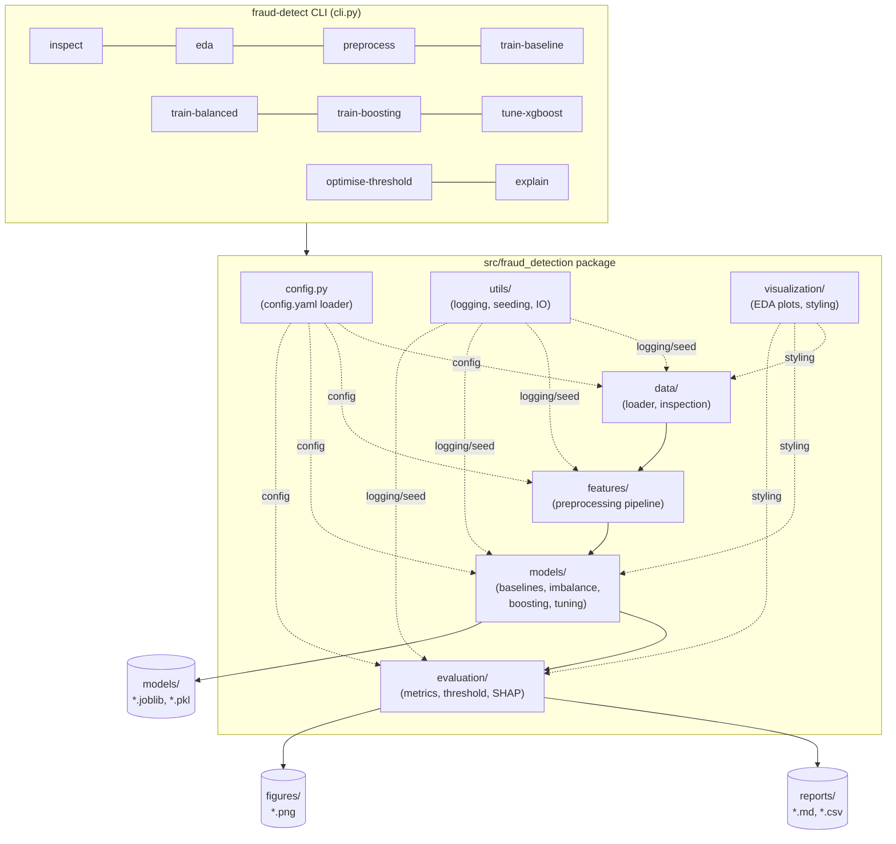

# Credit Card Fraud Detection

A production-quality, end-to-end machine-learning project that detects fraudulent
credit-card transactions on the classic
[Kaggle Credit Card Fraud dataset](https://www.kaggle.com/datasets/mlg-ulb/creditcardfraud)
(284,807 transactions, 0.173% fraud).

Built incrementally across 10 milestones — from raw-data inspection to a
tuned, threshold-optimised, SHAP-explained gradient-boosting model — with a
single command-line interface, no web app, API, database, or deployment
layer. Every stage is scripted, tested, and documented, and every reported
number is regenerated by running the corresponding CLI command against the
real dataset (nothing here is hand-typed or simulated).

**Production model:** weighted XGBoost · **PR-AUC 0.825** · recommended
decision threshold **0.20** (business-cost optimised) · fully explained with SHAP.

---

## Table of contents

- [Project overview](#project-overview)
- [Architecture](#architecture)
- [Pipeline / workflow](#pipeline--workflow)
- [Installation](#installation)
- [CLI usage](#cli-usage)
- [Project structure](#project-structure)
- [Model comparison](#model-comparison)
- [Threshold optimisation](#threshold-optimisation)
- [Explainability (SHAP)](#explainability-shap)
- [Results summary](#results-summary)
- [Testing](#testing)
- [Milestones](#milestones)
- [Future improvements](#future-improvements)
- [Acknowledgements](#acknowledgements)
- [License](#license)

---

## Project overview

Fraud detection is a canonical **extreme class-imbalance** problem: only
0.173% of transactions are fraudulent, so a naive "always legitimate"
classifier scores 99.8% accuracy while catching zero fraud. This project
treats that imbalance as the central engineering challenge, not an
afterthought, and works through it systematically:

1. Understand the data before modelling (inspection, EDA).
2. Build a leakage-safe preprocessing pipeline.
3. Establish honest, un-tuned baselines.
4. Compare every major imbalance-handling technique inside proper
   cross-validation pipelines.
5. Bring in gradient boosting and optimise it with Optuna.
6. Turn the model's probability output into a **business decision** via
   cost-based threshold optimisation.
7. Explain every prediction with SHAP so a human can audit *why* the model
   flagged a transaction.

The emphasis throughout is **methodology and evaluation**, not raw
leaderboard performance — every report explains *why* a metric moved, not
just *that* it moved.

---

## Architecture



Each sub-package maps to one concern: `data` loads and validates,
`features` scales/splits (leakage-safe), `models` trains and compares,
`evaluation` scores, thresholds, and explains. Config-driven paths mean no
module hard-codes a file location — everything resolves through
`config/config.yaml`.

---

## Pipeline / workflow

```mermaid
flowchart LR
    A["creditcard.csv\n(284,807 rows)"] --> B["M1 inspect\nshape, dtypes,\nclass balance"]
    B --> C["M2 eda\nimbalance, distributions,\ncorrelation, outliers"]
    C --> D["M3 preprocess\ndrop duplicates -> stratified split\n-> RobustScaler (train-fit only)"]
    D --> E["M4 train-baseline\nLogReg / Tree / Forest\n(vanilla, no imbalance handling)"]
    E --> F["M5 train-balanced\nclass-weight, under/over-sample,\nSMOTE, ADASYN (imblearn pipelines)"]
    F --> G["M6 train-boosting\nXGBoost + LightGBM\n(default & weighted)"]
    G --> H["M7 tune-xgboost\nOptuna TPE search,\nmaximise PR-AUC via CV"]
    H --> I["M8 optimise-threshold\nsweep 0.01-0.99,\nminimise business cost"]
    I --> J["M9 explain\nSHAP global + per-prediction\nfor the production model"]
    J --> K["Production decision:\nweighted XGBoost @ threshold 0.20"]
```



Every arrow is a real CLI command (`fraud-detect <step>`), and every step's
output (model, report, figures) is a fixed artifact consumed by the next
step — nothing is silently recomputed with different settings.

---

## Installation

```bash
git clone <this-repo>
cd "Credit Card Fraud Detection"

python -m venv .venv
# Windows:
.venv\Scripts\activate
# macOS / Linux:
source .venv/bin/activate

pip install -r requirements.txt
pip install -e .            # installs the `fraud-detect` CLI + importable package
```

Download `creditcard.csv` from Kaggle and place it at `data/raw/creditcard.csv`
(see [`data/raw/README.md`](data/raw/README.md) for exact steps). The raw file
is git-ignored — it is never committed to this repository.

Verify the install:

```bash
fraud-detect --help
pytest -q
```

---

## CLI usage

Every stage of the project is one command. Each writes its own report,
figures, and (where applicable) saved model(s) — nothing needs to be re-run
to inspect a previous milestone's output.

```bash
# M1 — dataset inspection: shape, dtypes, class balance, basic stats
fraud-detect inspect

# M2 — exploratory data analysis: imbalance/distribution/correlation/outlier figures + report
fraud-detect eda

# M3 — leakage-safe preprocessing pipeline: duplicate removal, stratified split, scaler comparison
fraud-detect preprocess

# M4 — baseline models: Logistic Regression, Decision Tree, Random Forest (vanilla)
fraud-detect train-baseline

# M5 — imbalance-handling comparison: class weighting, under/oversampling, SMOTE, ADASYN
fraud-detect train-balanced

# M6 — gradient boosting: XGBoost + LightGBM (default & class-weighted), vs. all prior models
fraud-detect train-boosting

# M7 — Optuna hyperparameter optimisation of the weighted XGBoost (PR-AUC objective)
fraud-detect tune-xgboost --trials 50

# M8 — business-cost threshold optimisation for the saved production model
fraud-detect optimise-threshold --fp-cost 1 --fn-cost 20

# M9 — SHAP explainability: global importance, dependence, and per-category waterfalls
fraud-detect explain --threshold 0.5
```

Global options: `--seed <int>` (default from config) is accepted by every
command for reproducibility.

---

## Project structure

```
Credit Card Fraud Detection/
├── config/
│   └── config.yaml                  # single source of truth: paths, seeds, hyperparameters
├── data/
│   ├── raw/                         # creditcard.csv lives here (git-ignored) + README
│   └── processed/                   # cached artifacts (generated)
├── notebooks/                       # reserved for exploratory notebooks (none required)
├── src/fraud_detection/             # the installable package
│   ├── config.py                    # config loading & path resolution
│   ├── cli.py                       # `fraud-detect` command-line entry point
│   ├── utils/                       # logging, seeding, JSON IO
│   ├── data/                        # loader.py (load + validate), inspection.py (M1)
│   ├── features/                    # preprocessing.py + report.py (M3: pipeline, scalers)
│   ├── models/                      # baselines.py (M4), imbalance.py + balanced_training.py (M5),
│   │                                # boosting.py + boosting_training.py (M6), tuning.py (M7)
│   ├── evaluation/                  # metrics.py (M4), threshold.py (M8), explainability.py (M9)
│   └── visualization/                # plotting.py (shared style), eda.py (M2)
├── reports/                         # generated markdown reports + CSV/JSON metrics per milestone
├── figures/                         # generated PNG figures (41 total)
├── models/                          # persisted models, pipelines, and the Optuna study (22 files)
├── tests/                           # 11 test modules, 50 tests
├── requirements.txt                 # pinned dependencies
├── pyproject.toml                   # packaging + pytest config
└── README.md                        # this file
```

> **Why `src/fraud_detection/` instead of bare `src/data`, `src/models`, …?**
> Wrapping every sub-module in one top-level package gives clean,
> unambiguous imports (`from fraud_detection.data import ...`), avoids
> `sys.path` hacks, and lets the project be pip-installed as a real CLI tool.

---

## Model comparison

Full leaderboard across every model family, evaluated on the identical
seeded test split (56,746 rows, 95 frauds), ranked by **PR-AUC** — never
accuracy (see [Why accuracy is the wrong metric here](#results-summary)):

| Rank | Model | Family | PR-AUC | ROC-AUC | Precision | Recall | F1 | Train time |
|---|---|---|---:|---:|---:|---:|---:|---:|
| 1 | **XGBoost (weighted)** | Boosting | **0.825** | 0.973 | 0.974 | 0.779 | 0.865 | 9.5 s |
| 2 | Random Oversampling · Random Forest | Balanced (M5) | 0.815 | 0.935 | 0.972 | 0.726 | 0.831 | 253.7 s |
| 3 | Random Forest | Baseline (M4) | 0.796 | 0.919 | 0.986 | 0.726 | 0.836 | 287.5 s |
| 4 | LightGBM (weighted) | Boosting | 0.789 | 0.970 | 0.854 | 0.800 | 0.826 | 17.6 s |
| 5 | Logistic Regression | Baseline (M4) | 0.695 | 0.958 | 0.862 | 0.589 | 0.700 | 1.6 s |
| 6 | XGBoost (default) | Boosting | 0.670 | 0.857 | 0.750 | 0.695 | 0.721 | 12.3 s |
| 7 | LightGBM (default) | Boosting | 0.135 | 0.711 | 0.260 | 0.474 | 0.336 | 10.2 s |

**Headline finding:** the winning model trains **~30x faster** than Random
Forest while beating it on every ranking metric. **Default LightGBM is a
trap** on this level of imbalance (PR-AUC 0.135) — `class_weight="balanced"`
is essential and recovers it to 0.789.

**Hyperparameter tuning (M7):** a 50-trial Optuna search (TPE sampler,
3-fold stratified CV, PR-AUC objective) reached CV PR-AUC 0.853, but the
gain **did not transfer to the held-out test set** (0.8251 → 0.8250, a
−0.0002 change). This is an honest negative result: the default weighted
XGBoost was already near-optimal, so it remains the production model
(full detail in [`reports/07_hyperparameter_optimization.md`](reports/07_hyperparameter_optimization.md)).

---

## Threshold optimisation

A model outputs a probability; a **business** decides which probability
counts as "fraud." Milestone 8 sweeps every threshold from 0.01 to 0.99 for
the production model and scores each one against a configurable cost model
(default: a missed fraud costs **20x** a false alarm).

| Operating point | Threshold | Precision | Recall | FP | FN | Business cost |
|---|---:|---:|---:|---:|---:|---:|
| Best precision | 0.71 | 0.986 | 0.768 | 1 | 22 | 441 |
| Best recall | 0.03 | 0.706 | 0.811 | 32 | 18 | 392 |
| Best F1 | 0.47 | 0.962 | 0.789 | 3 | 20 | 403 |
| **Recommended (min cost)** | **0.20** | **0.916** | **0.800** | **7** | **19** | **387** |
| Default | 0.50 | 0.974 | 0.779 | 2 | 21 | 422 |

At the default threshold of 0.50 the model is tuned for *precision*, not
*cost*. Lowering the cut-off to **0.20** catches 2 more frauds for 5 more
false alarms — a trade the FN=20×FP cost model says is worth it, saving
**35 units of cost (422 → 387)** on this test set alone. Re-running
`fraud-detect optimise-threshold --fp-cost <a> --fn-cost <b>` recomputes the
recommendation for any cost ratio a real business specifies. Full detail
and all 8 figures in [`reports/08_threshold_optimization.md`](reports/08_threshold_optimization.md).

---

## Explainability (SHAP)

Milestone 9 explains the production model with SHAP's exact `TreeExplainer`
— every number below is a real, computed SHAP value, not an estimate.

**Global feature importance** (mean |SHAP| over a 2,000-row test sample):

| Rank | Feature | Mean \|SHAP\| | Direction |
|---|---|---:|---|
| 1 | `V14` | 2.780 | lower → more fraud |
| 2 | `V4` | 1.389 | higher → more fraud |
| 3 | `V12` | 1.164 | lower → more fraud |
| 4 | `V10` | 0.947 | lower → more fraud |
| 5 | `V11` | 0.864 | higher → more fraud |

`Amount` and `Time` barely register — fraud is driven almost entirely by a
handful of anonymised PCA components, consistent with the correlation
analysis from the EDA (Milestone 2).

**Per-prediction transparency.** SHAP waterfall plots were generated for a
representative True Positive, False Positive, False Negative, and True
Negative, so every category of the confusion matrix has an auditable,
feature-by-feature explanation of *why* the model decided what it decided
— e.g. the True-Positive case moves from a base log-odds of −0.22 to +17.0,
with `V14 = −8.9` alone contributing **+8.21** toward the fraud verdict.

All 9 figures (bar importance, beeswarm summary, 3 dependence plots, 4
waterfalls) are in `figures/shap_*.png`; full narrative in
[`reports/09_shap_explainability.md`](reports/09_shap_explainability.md).

---

## Results summary

### Why accuracy is the wrong metric here

With 0.173% fraud, a model that predicts "legitimate" for **every**
transaction scores **99.83% accuracy** while catching **zero** fraud. This
project ranks every model by **PR-AUC** and inspects full confusion
matrices — accuracy is reported for completeness but never used to choose a
model.

### Final recommendation

| | |
|---|---|
| **Production model** | Weighted XGBoost (`models/boosting_xgboost_weighted.joblib`) |
| **Test PR-AUC** | 0.825 |
| **Recommended threshold** | 0.20 (FP cost = 1, FN cost = 20) |
| **At that threshold** | 80.0% recall, 91.6% precision, 7 FP / 19 FN on 56,746 test rows |
| **Why not the Optuna-tuned model?** | Tuning did not improve held-out PR-AUC (0.8250 vs 0.8251) |
| **Explainability** | SHAP TreeExplainer; top drivers `V14`, `V4`, `V12`, `V10`, `V11` |

---

## Testing

```bash
pytest -q
```

**50 tests** across 11 modules cover configuration, data loading/inspection,
EDA, preprocessing (leakage checks), baseline training, imbalance strategies
(leakage-safe imblearn pipelines), boosting, Optuna tuning, threshold
optimisation, and SHAP explainability. Tests run against small synthetic,
schema-matching fixtures — never the real 144 MB dataset — so the suite is
fast and fully offline.

---

## Milestones

| # | Milestone | Focus | Status |
|---|---|---|---|
| 1 | Project setup & data inspection | structure, environment, loading, basic stats | ✅ |
| 2 | Exploratory Data Analysis | imbalance, distributions, correlation, outliers | ✅ |
| 3 | Data preprocessing | scaling, stratified split, leakage-safe pipeline | ✅ |
| 4 | Baseline models | Logistic Regression, Decision Tree, Random Forest | ✅ |
| 5 | Imbalanced learning | class weighting, under/oversampling, SMOTE, ADASYN | ✅ |
| 6 | Gradient boosting | XGBoost, LightGBM (default & weighted) | ✅ |
| 7 | Hyperparameter optimisation | Optuna (TPE), PR-AUC objective, stratified CV | ✅ |
| 8 | Threshold optimisation | business-cost analysis, operating-point selection | ✅ |
| 9 | Explainable AI | SHAP global + per-prediction explanations | ✅ |
| 10 | Final project polish | cleanup, documentation, final verification | ✅ |

Each milestone was developed, tested, and documented before the next began;
per-milestone reports (`reports/0N_*.md`) and teaching notes
(`reports/milestone_0N_learning.md`) capture the reasoning behind every
decision.

---

## Future improvements

Explicitly out of scope for this project (by design — the focus is ML
methodology, not productionisation) but natural next steps for a real
deployment:

- **Serving & deployment** — a REST/gRPC endpoint, containerisation, and a
  model registry (none of this exists here on purpose).
- **Probability calibration** — Platt scaling / isotonic regression on top
  of the boosted trees for better-calibrated risk scores.
- **Drift monitoring** — feature and prediction-distribution monitoring in
  production, since this dataset is a static two-day snapshot.
- **Cost-sensitive learning at training time** — encode the FP/FN cost
  asymmetry directly into the boosting objective rather than only at the
  decision threshold.
- **Additional feature engineering** — since `V1`–`V28` are anonymised PCA
  components, a production system with raw features could engineer
  domain features (velocity, merchant history, device fingerprinting).
- **Time-based validation** — a temporal train/test split (rather than
  stratified-random) to better simulate real-world forward prediction.
- **CatBoost / ensembling** — a third boosting library and/or a stacked
  ensemble of the strongest models identified here.

---

## Acknowledgements

- Dataset: **Machine Learning Group – ULB (Université Libre de Bruxelles)**,
  made available on [Kaggle](https://www.kaggle.com/datasets/mlg-ulb/creditcardfraud).
- Core libraries: [scikit-learn](https://scikit-learn.org),
  [XGBoost](https://xgboost.readthedocs.io), [LightGBM](https://lightgbm.readthedocs.io),
  [imbalanced-learn](https://imbalanced-learn.org), [Optuna](https://optuna.org),
  [SHAP](https://shap.readthedocs.io), pandas, NumPy, and matplotlib/seaborn.

---

## License

MIT (code). The dataset retains its original Kaggle license and is not
redistributed in this repository.
