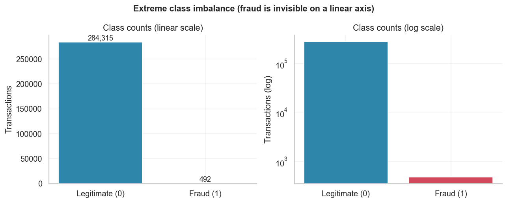
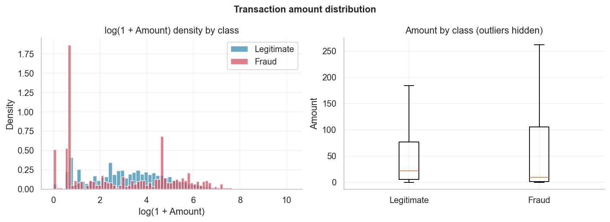
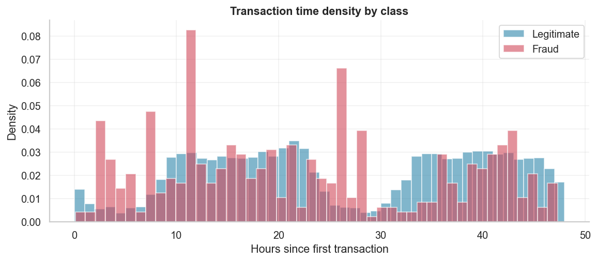
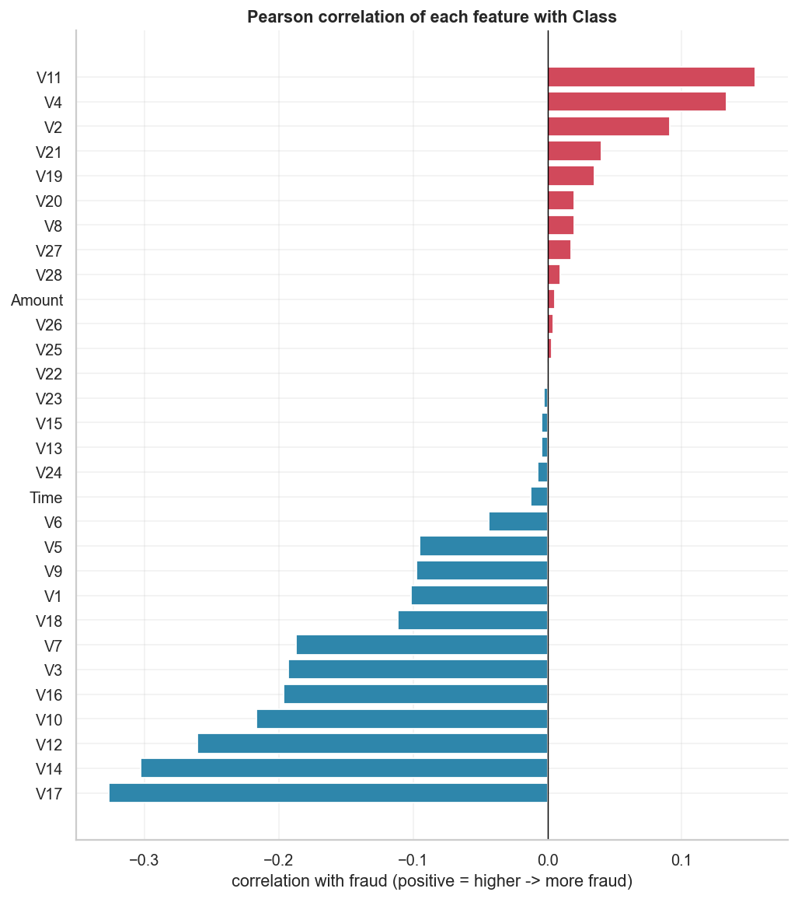
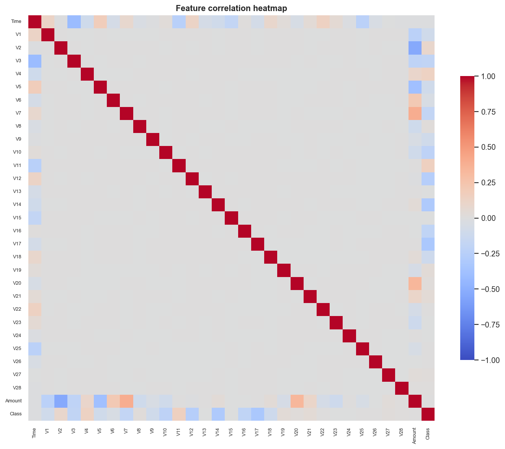
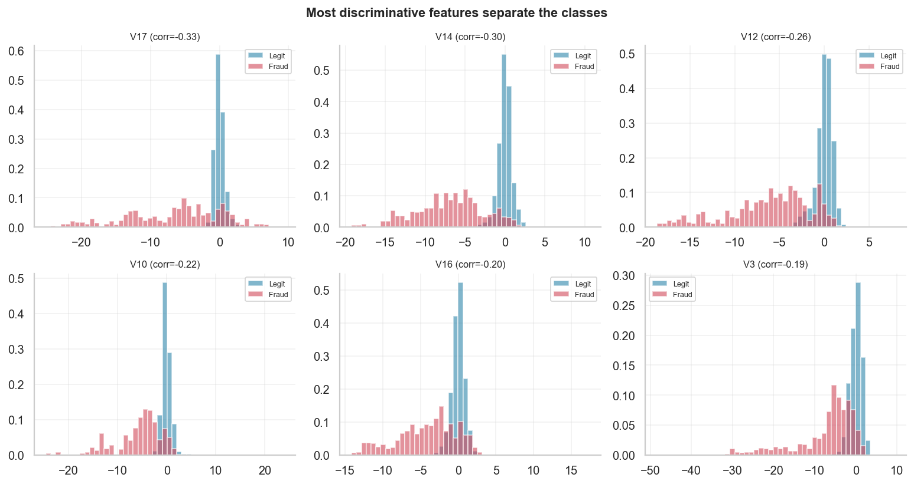
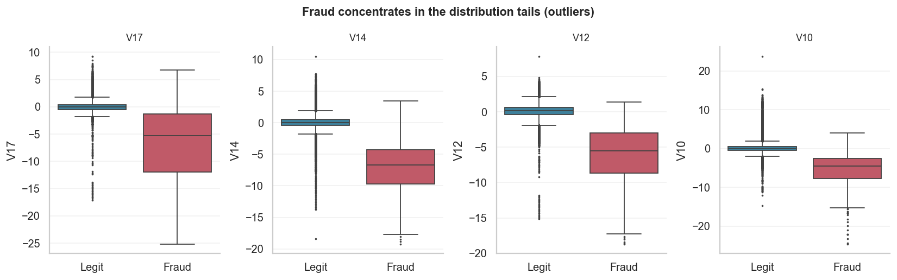

# Exploratory Data Analysis — Credit Card Fraud

*Auto-generated by `fraud_detection.visualization.eda`. Every figure below is
explained: how to read it, what we see, and why it matters.*

---

## 1. Class imbalance

**How to read it.** Left is a linear y-axis; right is the *same* data on a log
y-axis. The fraud bar is invisible on the left because fraud is
**0.173%** of the data (492 of 284,807).

**Why it matters.** This is the single most important plot in the project. It
means (a) **accuracy is useless** (predict "legit" always → 99.827%
accuracy, 0 fraud caught), and (b) models will be biased toward the majority
class unless we intervene with **class weights or resampling** (Milestone 5).

**Common mistake.** Reporting only the linear chart and concluding "there's
barely any fraud so it doesn't matter" — the opposite is true.

---

## 2. Transaction `Amount`

**How to read it.** Left: the density of `log(1 + Amount)` per class (we log it
because `Amount` is extremely right-skewed — max ≈ 25,691 vs median 22). Right:
box plots per class with extreme outliers hidden so the boxes are legible.

**What we see.** Fraudulent amounts skew **lower** and are more concentrated;
big-ticket purchases are overwhelmingly legitimate. `Amount` alone is a weak
separator, but it interacts usefully with other features.

**Why it matters.** The heavy tail is why we prefer **RobustScaler** (median/IQR)
over StandardScaler (mean/std) for `Amount` in Milestone 3 — a handful of huge
values would otherwise dominate the mean and variance.

---

## 3. Transaction `Time`

**How to read it.** Density of transactions over the ~48-hour window, per class.

**What we see.** Legitimate traffic has a clear **day/night cycle** (two humps,
troughs overnight). Fraud is **flatter** — fraudsters don't sleep on the
cardholder's schedule. Raw `Time` is only weakly predictive on its own, which is
why feature-engineering "hour of day" is a classic extension.

---

## 4. Which features relate to fraud?

**How to read it.** Each bar is a feature's Pearson correlation with `Class`
(right/red = higher value pushes toward fraud, left/blue = pushes toward
legitimate). Strongest positive: `V11` (+0.15), `V4` (+0.13), `V2` (+0.09). Strongest negative: `V17` (-0.33), `V14` (-0.30), `V12` (-0.26).

**Why it matters.** These are the features to watch in modelling and
explainability (Milestone 9). **Caveat:** Pearson only captures *linear*
association — a low bar does **not** mean "useless", because tree/boosting models
exploit non-linear interactions a correlation can't see.

---

## 5. Correlation structure (heatmap)

**How to read it.** Red = positive, blue = negative correlation; the diagonal is
1 by definition.

**What we see.** The `V1`–`V28` block is almost entirely pale — they are
**PCA components, so decorrelated by construction**. This means we don't have the
multicollinearity headaches you'd get with raw features, and each component adds
roughly independent information.

---

## 6. Do the top features actually separate the classes?

**How to read it.** For the six most-correlated features, the blue (legit) and
red (fraud) density histograms are overlaid. **The more the red and blue peaks
are shifted apart, the more that feature separates fraud from legit.**

**What we see.** For features like `V17` and `V14`, the
fraud distribution is clearly displaced from legit — visible, exploitable signal.

---

## 7. Outlier analysis

**How to read it.** Box plots per class for the top features. The box is the
interquartile range (IQR = 25th–75th percentile); whiskers extend 1.5×IQR; dots
are Tukey outliers.

**The key insight.** For `V17`, transactions flagged as IQR
outliers (2.6% of all rows) have a fraud rate of
**5.35%**, versus
**0.034%** among non-outliers — a
**156× enrichment**.

> **This is why we do NOT blindly delete outliers in fraud detection.** In most
> ML tasks outliers are noise; here, **the outliers *are* disproportionately the
> thing we are trying to find.** Removing them would throw away signal.

Features with the most IQR outliers:

| Feature | # Outliers | % of rows |
|---------|-----------:|----------:|
| `V27` | 39,163 | 13.8% |
| `Amount` | 31,904 | 11.2% |
| `V28` | 30,342 | 10.7% |
| `V20` | 27,770 | 9.8% |
| `V8` | 24,134 | 8.5% |
| `V6` | 22,965 | 8.1% |

---

## 8. EDA takeaways → decisions

1. **Imbalance is severe** → use PR-AUC / recall / precision, class weights,
   and resampling. Never accuracy.
2. **Scale `Time` and `Amount`** (robust scaling for `Amount`); the PCA features
   are already comparable.
3. **A subset of `V` features carries strong linear signal**, but keep all of
   them — trees find non-linear structure Pearson misses.
4. **Do not drop outliers** — they are fraud-enriched.
5. **Consider removing the 1,081 duplicate rows** before splitting to prevent
   leakage (revisited in Milestone 3).
