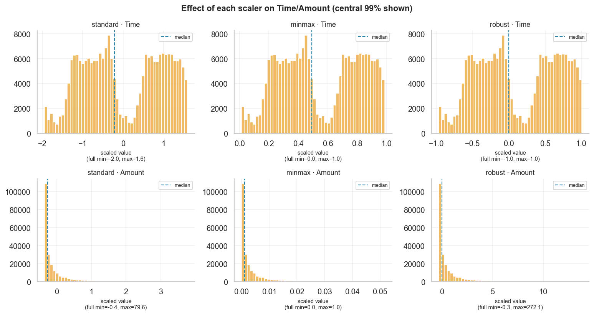

# Preprocessing Report — Credit Card Fraud (Milestone 3)

*Auto-generated by `fraud_detection.features.report`. Deep concept explanations
live in [`milestone_03_learning.md`](milestone_03_learning.md).*

---

## 1. Duplicate handling — decision & evidence

The EDA found exact-duplicate rows. Our policy (config
`preprocessing.remove_duplicates`) and the reasoning:

| Metric | Value |
|--------|------:|
| Rows before | 284,807 |
| Exact duplicates removed | 1,081 |
| — of which fraud | 19 |
| — of which legitimate | 1,062 |
| Rows after | 283,726 |

**Decision: remove exact duplicates *before* splitting.**

- *Why remove?* All 31 columns (incl. the second-resolution `Time` and 28
  continuous PCA floats) being identical is a data artifact, not two genuinely
  distinct transactions. Keeping them lets the model "memorise" repeated rows.
- *Why before the split?* If duplicates are removed *after* splitting, copies of
  the same row can land in **both** train and test — the model is then tested on
  rows it trained on (**leakage**), inflating scores. Removing first guarantees
  train/test are disjoint. Duplicate removal has no learned parameters, so doing
  it on the full data introduces no leakage of its own.

## 2. Train/test split summary

Stratified split with `test_size = 0.2`, seed
`42`:

| Split | Rows | Fraud | Fraud rate |
|-------|-----:|------:|-----------:|
| Train | 226,980 | 378 | 0.167% |
| Test  | 56,746 | 95 | 0.167% |

The two fraud rates match to three decimals — that is stratification working. A
plain random split at 0.17% positives could easily skew the fraud count between
sides; stratifying keeps evaluation honest.

## 3. Scaler comparison (model-free)

Each scaler was fit on the **training** `Amount`/`Time` only. We compare their
*effect on the data* rather than downstream accuracy (no model is trained in
this milestone).

**`Amount`** (the heavy-tailed column):

| scaler | mean | std | min | p1 | median | p99 | max | IQR |
|--------|-----:|----:|----:|---:|-------:|----:|----:|----:|
| standard | 7.49e-17 | 1 | -0.36 | -0.359 | -0.27 | 3.78 | 79.6 | 0.294 |
| minmax | 0.0045 | 0.0125 | 0 | 6.1e-06 | 0.00112 | 0.0517 | 1 | 0.00367 |
| robust | 0.919 | 3.41 | -0.306 | -0.304 | 0 | 13.8 | 272 | 1 |

**`Time`:**

| scaler | mean | std | min | p1 | median | p99 | max | IQR |
|--------|-----:|----:|----:|---:|-------:|----:|----:|----:|
| standard | -1.52e-16 | 1 | -2 | -1.95 | -0.212 | 1.59 | 1.64 | 1.79 |
| minmax | 0.549 | 0.275 | 0 | 0.014 | 0.491 | 0.987 | 1 | 0.493 |
| robust | 0.118 | 0.558 | -0.996 | -0.968 | 0 | 1.01 | 1.03 | 1 |



**How to read the table.** `min`/`max` are the post-scaling extremes; `p1`/`p99`
are the 1st/99th percentiles; `IQR` is the interquartile spread.

- **StandardScaler** `(x-μ)/σ`: the outliers inflate σ, so the *typical* value
  ends up squeezed into a narrow band while the max stays huge (e.g. ~100).
- **MinMaxScaler** `(x-min)/(max-min)`: one 25,691 outlier maps to 1.0 and
  crushes the entire bulk toward 0 (median ≈ 0.0009) — almost all information is
  compressed into a tiny sliver of [0, 1].
- **RobustScaler** `(x-median)/IQR`: centres on the median and scales by the IQR,
  so the central 50% of data occupies a sensible range and the heavy tail does
  **not** distort the transform.

**Choice: `robust` (RobustScaler).** The EDA showed `Amount` is extremely
right-skewed with genuine (fraud-enriched) outliers we must keep; RobustScaler is
the only option here that scales the bulk sensibly *without* being dominated by,
or discarding, those outliers.

## 4. The preprocessing pipeline

```
Pipeline(steps=[
    ("preprocess", ColumnTransformer(
        transformers=[("scale", RobustScaler(), ['Time', 'Amount'])],
        remainder="passthrough",           # V1..V28 untouched
        verbose_feature_names_out=False,   # keep original names
    )),
])   # .set_output(transform="pandas")
```

**Why an sklearn `Pipeline`?**

- **No leakage:** `fit` learns scaler stats on train; `transform` reuses them on
  test / production. You cannot accidentally fit on test.
- **Reproducibility:** one object encapsulates every transform in order.
- **Cleaner code & deployment:** the same fitted object goes from notebook to
  production; new data flows through identical steps.

## 5. Feature selection — discussed, **not applied yet**

We deliberately keep all 30 features for now. Techniques we will weigh later:

- **VarianceThreshold** — drop near-constant features (none here; PCA components
  all vary).
- **Correlation-based selection** — drop redundant, highly inter-correlated
  features (the PCA block is already decorrelated, so little to gain).
- **Recursive Feature Elimination (RFE)** — iteratively drop the weakest feature
  by model coefficients/importance.
- **Tree-based importance** — rank features by a fitted forest/boosting model.

**Why not now?** (1) All are cheap and lossless to defer; (2) RFE and tree
importance **require a trained model**, which belongs to later milestones; (3)
with only 30 decorrelated features and no dimensionality problem, premature
pruning risks discarding fraud signal for no real benefit. Feature selection
should be justified by *model* evidence, which we don't have yet.

## 6. Data leakage — worked examples

Leakage = information available at training that would **not** be available at
prediction time, producing scores that collapse in production. Examples:

1. **Fitting the scaler on all data** before splitting — test statistics bleed
   into training. (Prevented here by fitting inside the pipeline on train only.)
2. **Duplicate rows across the split** (§1).
3. **Target leakage** — a feature that encodes the label (e.g. a "fraud
   investigation opened" flag created *after* the transaction was judged).
4. **Temporal leakage** — using future information to predict the past.
5. **Oversampling before splitting** (relevant in Milestone 5) — synthetic copies
   of a train point leaking into test.

## 7. Saved artifacts

| Artifact | Path |
|----------|------|
| Fitted preprocessing pipeline | `models/preprocessing_pipeline.joblib` |
| Scaler comparison table | `reports/03_scaler_comparison.csv` |
| Split summary | `reports/03_train_test_split_summary.json` |
| Scaler comparison figure | `figures/scaler_comparison.png` |

Persisting the *fitted* pipeline is essential: at prediction time we must apply
the **exact** transform (same medians/IQRs) learned at training. Re-fitting on
new data would silently change the feature space the model expects.
