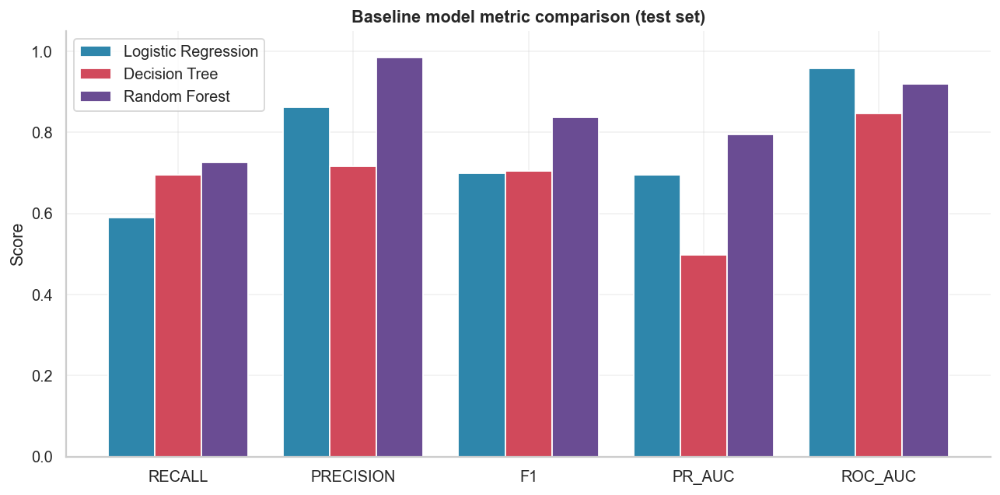
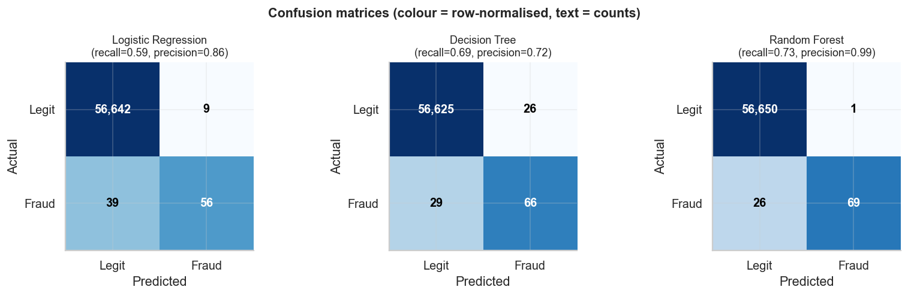

# Baseline Models Report — Credit Card Fraud (Milestone 4)

*Auto-generated by `fraud_detection.models.training`. Deep per-algorithm teaching
lives in [`milestone_04_learning.md`](milestone_04_learning.md).*

## Setup

- **Preprocessing:** the Milestone-3 pipeline (RobustScaler on `Time`/`Amount`,
  PCA components passed through), fit on the training split only.
- **Split:** the same seeded stratified split — train **226,980**, test
  **56,746** (95 frauds in test), 30 features.
- **Models:** vanilla defaults — **no `class_weight`, no resampling, no tuning.**
  This is a deliberate honest baseline that later milestones must beat.

## Performance table (test set)

| model | accuracy | precision | recall | f1 | roc_auc | pr_auc | train_time_s | predict_time_s |
|---|---|---|---|---|---|---|---|---|
| Logistic Regression | 0.9992 | 0.8615 | 0.5895 | 0.7000 | 0.9575 | 0.6951 | 1.567 | 0.018 |
| Decision Tree | 0.9990 | 0.7174 | 0.6947 | 0.7059 | 0.8471 | 0.4989 | 59.313 | 0.041 |
| Random Forest | 0.9995 | 0.9857 | 0.7263 | 0.8364 | 0.9191 | 0.7958 | 287.508 | 0.546 |

- `train_time_s` / `predict_time_s` are wall-clock seconds (prediction is over
  all 56,746 test rows).

## Leaderboard (ranked by PR_AUC)

| rank | model | pr_auc | roc_auc | recall | precision | f1 |
|---|---|---|---|---|---|---|
| 1 | Random Forest | 0.7958 | 0.9191 | 0.7263 | 0.9857 | 0.8364 |
| 2 | Logistic Regression | 0.6951 | 0.9575 | 0.5895 | 0.8615 | 0.7000 |
| 3 | Decision Tree | 0.4989 | 0.8471 | 0.6947 | 0.7174 | 0.7059 |

## Confusion matrices

Read them **row-wise**: the bottom row is the 95 real frauds, split into
caught (bottom-right, TP) vs missed (bottom-left, FN). Accuracy is dominated by
the huge top-left (TN) cell — which is exactly why we do not rank on accuracy.

## Which model performed best?

**Random Forest** leads on PR_AUC
(0.7958). On raw recall (frauds caught), the leader is
**Random Forest** (0.7263).

## Which model surprised, and why?

**The headline surprise: the ROC-AUC leader is NOT the PR-AUC leader.** **Logistic Regression** tops ROC-AUC (0.958, vs Random Forest's 0.919), yet on **PR-AUC** the order flips hard: Random Forest 0.796 vs Logistic Regression 0.695. This is the classic warning that **ROC-AUC is over-optimistic under extreme imbalance** (it is rewarded for ranking the ~284k easy negatives), while **PR-AUC** concentrates on the rare positives we actually care about. Here, trust PR-AUC.

- A **single Decision Tree** (grown to full depth) **overfits** the training set,
  yet still catches a fair share of frauds — but its probability estimates are
  coarse (near-0/1 leaves), so its ranking metrics (PR-AUC especially) lag badly.
- **Random Forest** averages many decorrelated trees, giving the best PR-AUC, F1,
  and precision with far better-calibrated probabilities — achieved here with
  **no imbalance handling at all.**

## Discussion

**Why does Logistic Regression often remain a strong baseline?** It is fast,
convex (no local minima), well-calibrated, interpretable via coefficients/odds,
and hard to beat when the signal is roughly linear — as PCA features tend to be.
It sets a floor every fancier model should clear.

**Why might Random Forest outperform a Decision Tree?** A single tree is
high-variance: small data changes swing it wildly and it memorises noise. A
forest **bags** many trees on bootstrap samples with random feature subsets, so
their errors partly cancel (variance reduction). The average is smoother, more
robust, and better-calibrated.

**Why can Decision Trees overfit?** Grown unrestricted, a tree keeps splitting
until leaves are pure — eventually carving out individual training points
(including noise). Deep, pure leaves = memorisation = poor generalisation. Depth
limits, min-samples-per-leaf, or pruning are the usual fixes (tuning — later).

**Which models required feature scaling?** Only **Logistic Regression** truly
benefits: its gradient/regularisation are scale-sensitive, so unscaled `Amount`
would dominate. **Decision Tree and Random Forest are scale-invariant** — they
split on thresholds, so any monotonic rescale gives identical splits. We scale
uniformly anyway so all models share one clean pipeline.

## Takeaways

1. Every model scores **>99.8% accuracy** — and yet the confusion matrices show
   real frauds slipping through. Accuracy is meaningless here.
2. **PR-AUC and recall** separate the models meaningfully; the forest leads.
3. These are **untuned, imbalance-blind** baselines. Milestones 5–7 (resampling,
   boosting, tuning) will try to raise recall without wrecking precision.
