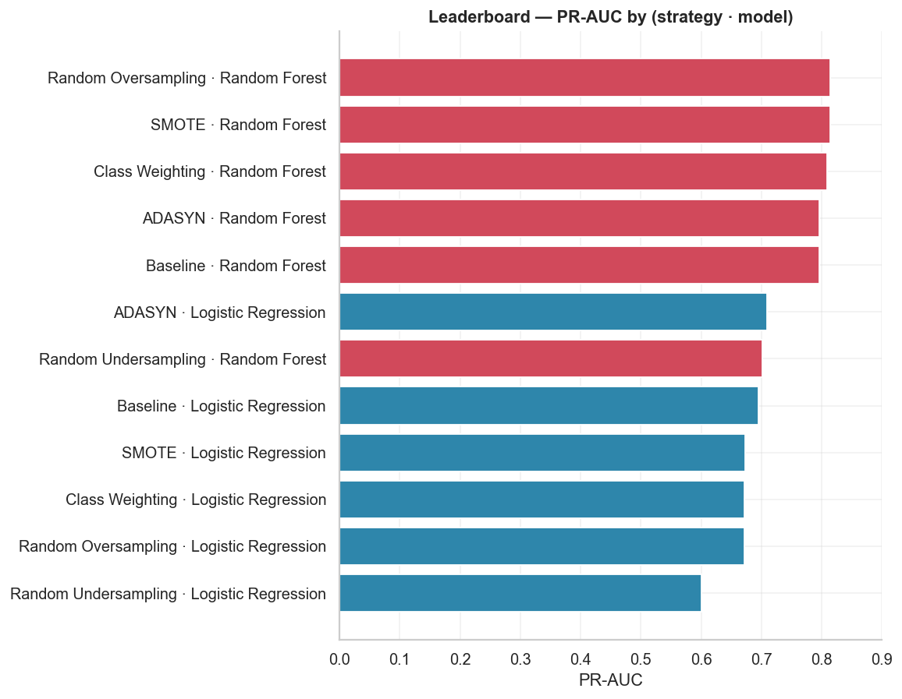
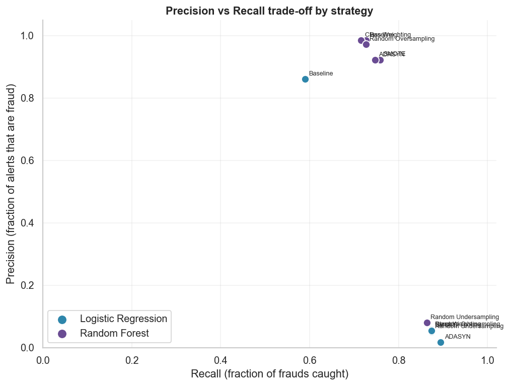
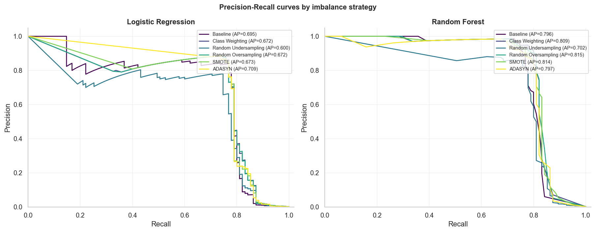
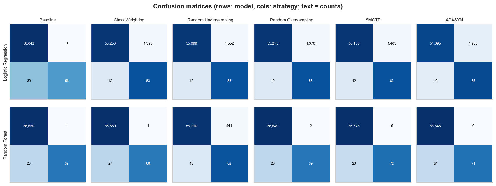

# Imbalance Handling Report — Credit Card Fraud (Milestone 5)

*Auto-generated by `fraud_detection.models.balanced_training`. Per-method teaching
lives in [`milestone_05_learning.md`](milestone_05_learning.md).*

## Setup

- **Same split as M3/M4:** train/test from the seeded stratified split
  (56,746 test rows, 95 frauds).
- **Every resampler runs inside an `imblearn.pipeline.Pipeline`** as
  `preprocess → resample → model`. imblearn applies resampling **only during
  `fit`** (training data) and bypasses it at `predict`, so the test set stays
  pristine.
- **Models:** the same vanilla Logistic Regression and Random Forest as M4 (no
  tuning). `class_weight="balanced"` is used *only* for the class-weighting
  strategy.

### Why resampling before the split is catastrophic leakage

If you SMOTE/oversample (or even undersample) the **whole dataset and then
split**, synthetic or duplicated minority points derived from a given fraud can
land in **both** train and test. The model then trains on near-copies of the
rows it is later "tested" on, so test recall/precision look great and **collapse
in production**. Undersampling-before-split similarly makes the test set
non-representative. The fix — used here — is to resample **inside the pipeline**
so it only ever sees the training fold.

## Results — Logistic Regression

| strategy | precision | recall | f1 | roc_auc | pr_auc | tp | fp | fn | train_time_s | predict_time_s |
|---|---|---|---|---|---|---|---|---|---|---|
| Baseline | 0.862 | 0.589 | 0.700 | 0.958 | 0.695 | 56 | 9 | 39 | 2.3 | 0.037 |
| Class Weighting | 0.056 | 0.874 | 0.106 | 0.966 | 0.672 | 83 | 1393 | 12 | 5.9 | 0.052 |
| Random Undersampling | 0.051 | 0.874 | 0.096 | 0.955 | 0.600 | 83 | 1552 | 12 | 0.2 | 0.031 |
| Random Oversampling | 0.057 | 0.874 | 0.107 | 0.966 | 0.672 | 83 | 1376 | 12 | 8.3 | 0.030 |
| SMOTE | 0.054 | 0.874 | 0.101 | 0.960 | 0.673 | 83 | 1463 | 12 | 19.0 | 0.046 |
| ADASYN | 0.017 | 0.895 | 0.033 | 0.958 | 0.709 | 85 | 4956 | 10 | 11.0 | 0.035 |

## Results — Random Forest

| strategy | precision | recall | f1 | roc_auc | pr_auc | tp | fp | fn | train_time_s | predict_time_s |
|---|---|---|---|---|---|---|---|---|---|---|
| Baseline | 0.986 | 0.726 | 0.836 | 0.919 | 0.796 | 69 | 1 | 26 | 254.3 | 0.569 |
| Class Weighting | 0.986 | 0.716 | 0.829 | 0.935 | 0.809 | 68 | 1 | 27 | 144.3 | 0.837 |
| Random Undersampling | 0.080 | 0.863 | 0.147 | 0.975 | 0.702 | 82 | 941 | 13 | 1.1 | 0.722 |
| Random Oversampling | 0.972 | 0.726 | 0.831 | 0.935 | 0.815 | 69 | 2 | 26 | 253.7 | 0.384 |
| SMOTE | 0.923 | 0.758 | 0.832 | 0.971 | 0.814 | 72 | 6 | 23 | 443.5 | 0.710 |
| ADASYN | 0.922 | 0.747 | 0.826 | 0.960 | 0.797 | 71 | 6 | 24 | 585.1 | 0.588 |

## Leaderboard (ranked by PR-AUC)

| rank | strategy | model | pr_auc | recall | precision | f1 | roc_auc |
|---|---|---|---|---|---|---|---|
| 1 | Random Oversampling | Random Forest | 0.815 | 0.726 | 0.972 | 0.831 | 0.935 |
| 2 | SMOTE | Random Forest | 0.814 | 0.758 | 0.923 | 0.832 | 0.971 |
| 3 | Class Weighting | Random Forest | 0.809 | 0.716 | 0.986 | 0.829 | 0.935 |
| 4 | ADASYN | Random Forest | 0.797 | 0.747 | 0.922 | 0.826 | 0.960 |
| 5 | Baseline | Random Forest | 0.796 | 0.726 | 0.986 | 0.836 | 0.919 |
| 6 | ADASYN | Logistic Regression | 0.709 | 0.895 | 0.017 | 0.033 | 0.958 |
| 7 | Random Undersampling | Random Forest | 0.702 | 0.863 | 0.080 | 0.147 | 0.975 |
| 8 | Baseline | Logistic Regression | 0.695 | 0.589 | 0.862 | 0.700 | 0.958 |
| 9 | SMOTE | Logistic Regression | 0.673 | 0.874 | 0.054 | 0.101 | 0.960 |
| 10 | Class Weighting | Logistic Regression | 0.672 | 0.874 | 0.056 | 0.106 | 0.966 |
| 11 | Random Oversampling | Logistic Regression | 0.672 | 0.874 | 0.057 | 0.107 | 0.966 |
| 12 | Random Undersampling | Logistic Regression | 0.600 | 0.874 | 0.051 | 0.096 | 0.955 |

## Precision vs Recall trade-off

## Precision-Recall curves

## Confusion matrices

## Discussion

**Which technique increased recall the most?** The highest single recall is
**ADASYN · Logistic Regression** at **0.895**
(vs the Random-Forest baseline's 0.726). Undersampling and
SMOTE/ADASYN typically push recall up the hardest.

**Which sacrificed precision?** **ADASYN · Logistic Regression**
has the lowest precision (**0.017**) — the classic cost
of aggressive rebalancing: more frauds caught, but many more false alarms.

**Which achieved the best PR-AUC?** **Random Oversampling · Random Forest**
(PR-AUC **0.815**). PR-AUC is threshold-independent, so it rewards
methods that improve the *ranking* of frauds, not just the 0.5-threshold
confusion matrix.

**Is higher recall always better?** **No.** Recall alone is trivially maxed by
flagging everything (recall = 1, precision ≈ 0). At 0.167% fraud, each false
positive means a legitimate customer is blocked/reviewed; a 50%-precision model
doubles investigation workload. The right operating point balances fraud caught
against false-alarm cost — which is exactly threshold tuning (Milestone 8).

**Would you deploy this for a real bank?** Not yet. These are **untuned**,
imbalance-only models judged at a fixed 0.5 threshold. A production system needs:
(1) a **business-chosen threshold** trading recall vs precision against the cost
of missed fraud vs false alarms; (2) **boosting + tuning** (Milestones 6–7) for
better PR-AUC; (3) **calibrated probabilities**; (4) monitoring for **drift**;
and (5) a human review queue for borderline alerts. Resampling improves recall,
but a bank cares about **precision at an acceptable recall** and the dollar cost
of each error.

## Takeaways

1. **Class weighting** is the cheapest imbalance fix (one parameter, no extra
   rows) and often competitive — try it first.
2. **Undersampling** is fast (tiny training set) and lifts recall, but throws away
   data and can hurt precision/PR-AUC.
3. **Oversampling / SMOTE / ADASYN** raise recall by inventing minority rows, at
   real **computational cost** (training set ~doubles) and often lower precision.
4. **PR-AUC barely moves** for the strong models — rebalancing mostly shifts the
   operating point, which **threshold tuning achieves without touching the data**.
