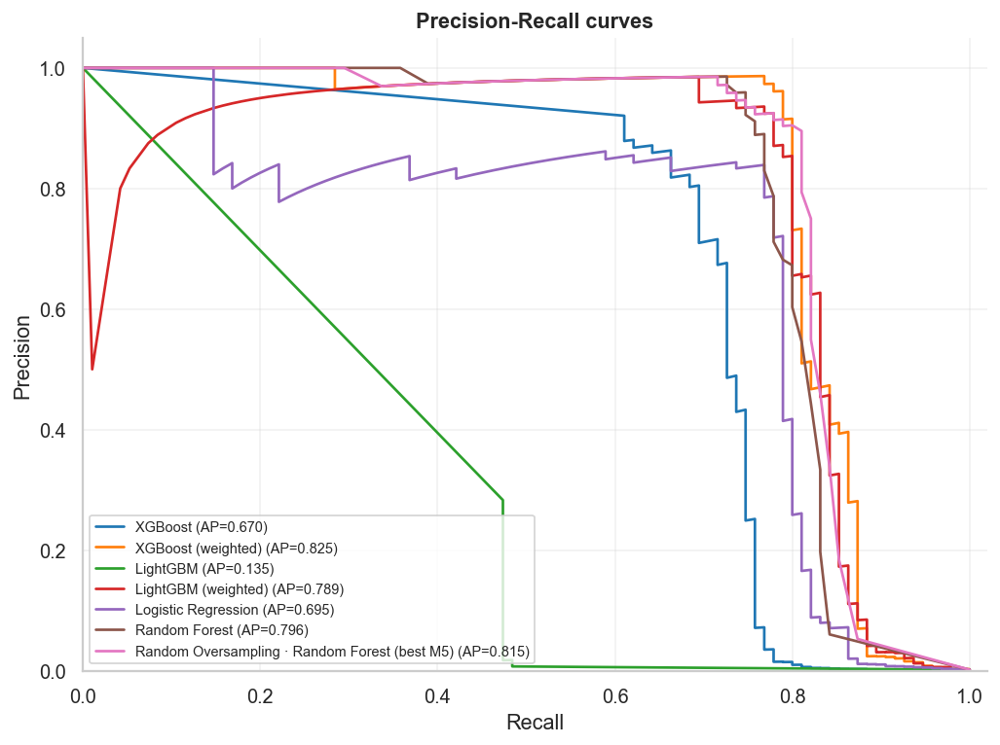
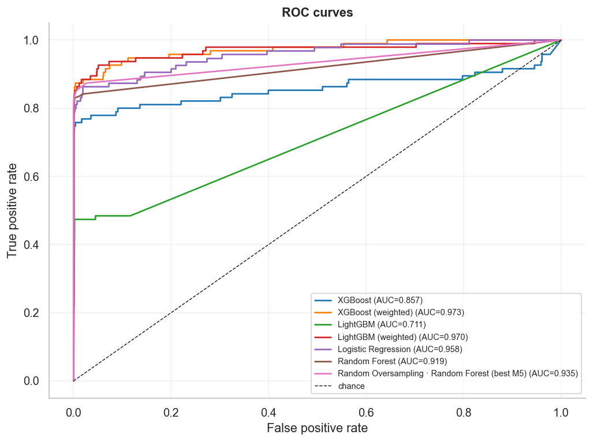
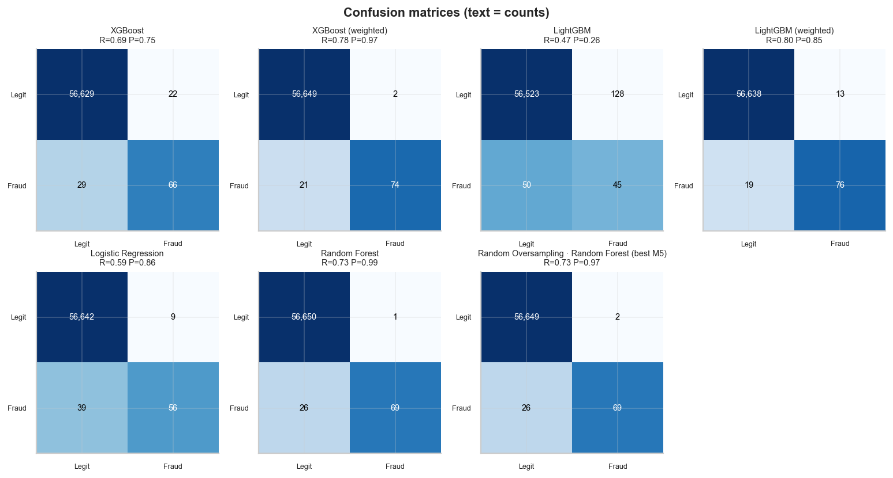
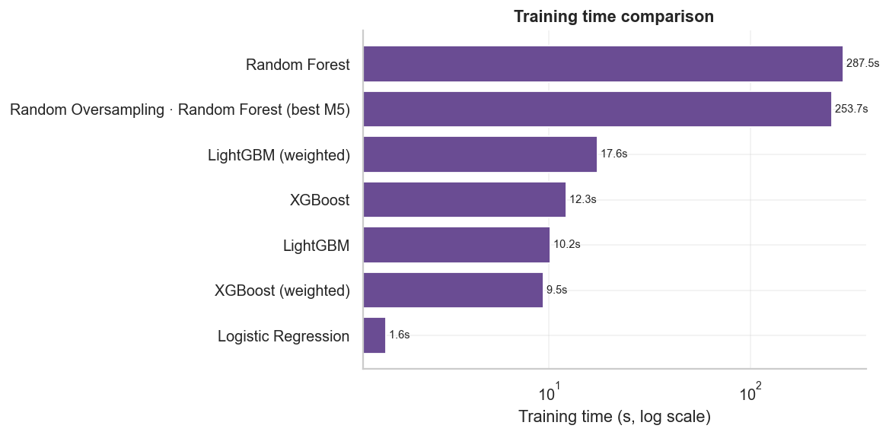

# Boosting Models Report — Credit Card Fraud (Milestone 6)

*Auto-generated by `fraud_detection.models.boosting_training`.*

## Setup

- **XGBoost** and **LightGBM**, each in a *default* and a *class-weighted*
  variant (`scale_pos_weight` / `class_weight="balanced"`). Library defaults —
  **no hyperparameter tuning.**
- Same preprocessing pipeline and seeded train/test split as M3–M5
  (56,746 test rows, 95 frauds).
- Compared against the saved **Logistic Regression**, **Random Forest**, and the
  **best Milestone-5 balanced model** (reused, not retrained).

## Performance comparison (test set)

| model | family | accuracy | precision | recall | f1 | roc_auc | pr_auc | train_time_s | predict_time_s |
|---|---|---|---|---|---|---|---|---|---|
| XGBoost | Boosting | 0.9991 | 0.7500 | 0.6947 | 0.7213 | 0.8575 | 0.6701 | 12.3 | 0.152 |
| XGBoost (weighted) | Boosting | 0.9996 | 0.9737 | 0.7789 | 0.8655 | 0.9728 | 0.8251 | 9.5 | 0.177 |
| LightGBM | Boosting | 0.9969 | 0.2601 | 0.4737 | 0.3358 | 0.7112 | 0.1351 | 10.2 | 0.356 |
| LightGBM (weighted) | Boosting | 0.9994 | 0.8539 | 0.8000 | 0.8261 | 0.9702 | 0.7890 | 17.6 | 0.394 |
| Logistic Regression | Baseline | 0.9992 | 0.8615 | 0.5895 | 0.7000 | 0.9575 | 0.6951 | 1.6 | 0.031 |
| Random Forest | Baseline | 0.9995 | 0.9857 | 0.7263 | 0.8364 | 0.9191 | 0.7958 | 287.5 | 0.486 |
| Random Oversampling · Random Forest (best M5) | Balanced | 0.9995 | 0.9718 | 0.7263 | 0.8313 | 0.9347 | 0.8147 | 253.7 | 0.317 |

## Leaderboard (ranked by PR-AUC)

| rank | model | family | pr_auc | roc_auc | recall | precision | f1 |
|---|---|---|---|---|---|---|---|
| 1 | XGBoost (weighted) | Boosting | 0.8251 | 0.9728 | 0.7789 | 0.9737 | 0.8655 |
| 2 | Random Oversampling · Random Forest (best M5) | Balanced | 0.8147 | 0.9347 | 0.7263 | 0.9718 | 0.8313 |
| 3 | Random Forest | Baseline | 0.7958 | 0.9191 | 0.7263 | 0.9857 | 0.8364 |
| 4 | LightGBM (weighted) | Boosting | 0.7890 | 0.9702 | 0.8000 | 0.8539 | 0.8261 |
| 5 | Logistic Regression | Baseline | 0.6951 | 0.9575 | 0.5895 | 0.8615 | 0.7000 |
| 6 | XGBoost | Boosting | 0.6701 | 0.8575 | 0.6947 | 0.7500 | 0.7213 |
| 7 | LightGBM | Boosting | 0.1351 | 0.7112 | 0.4737 | 0.2601 | 0.3358 |

## Figures

## Best-performing model

**XGBoost (weighted)** (Boosting) leads on PR-AUC (**0.8251**),
with recall 0.779 and precision 0.974. Highest
recall overall: **LightGBM (weighted)** (0.800).

## Strengths & weaknesses

- **XGBoost (weighted)** — the standout: PR-AUC 0.825 with
  high precision *and* the best F1, trained in ~9s.
  `scale_pos_weight` lifts default XGBoost from 0.670 to
  0.825.
- **LightGBM** — fast, but **fragile on extreme imbalance out of the box**:
  default LightGBM collapses to PR-AUC 0.135, while
  `class_weight="balanced"` rescues it to 0.789. Always set
  the imbalance flag with LightGBM.
- **Random Forest** — competitive PR-AUC (0.796) but ~30x slower
  to train than the winning booster.
- **Logistic Regression** — fast and interpretable, but the weakest ranker
  (PR-AUC 0.695).

## Which model for production?

**XGBoost (weighted)** is the recommended candidate: top PR-AUC
(0.825), recall 0.779 at precision
0.974 (only 2 false positives on 56,746
test rows), ~10s training, and millisecond inference. The final *operating
threshold* (recall vs false-alarm cost) is set in Milestone 8; the un-weighted
booster or a different threshold are the levers for another trade-off.

## Key observations

1. **Boosting wins on both axes.** XGBoost (weighted) beats Random Forest and the
   best Milestone-5 model on PR-AUC while training **~30x faster** (seconds vs
   minutes).
2. **For boosting, class weighting changes the *ranking*, not just the
   threshold** — unlike Random Forest in M5. Weighting raised XGBoost PR-AUC
   0.670 → 0.825 and LightGBM 0.135 →
   0.789.
3. **Default LightGBM is a trap on 0.167% data** (PR-AUC 0.135); the
   imbalance flag is essential.
4. All models exceed 99.9% accuracy; ranking is decided by **PR-AUC and the
   recall/precision trade-off**, never accuracy.
