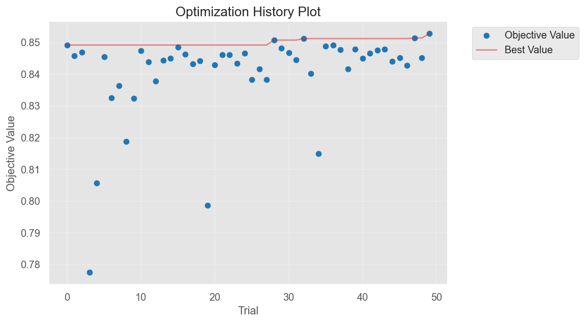
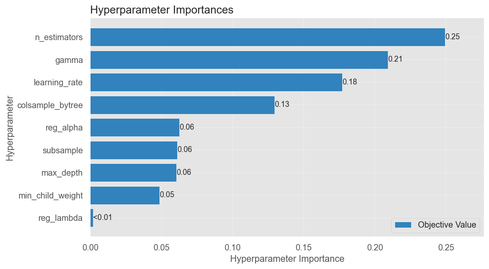
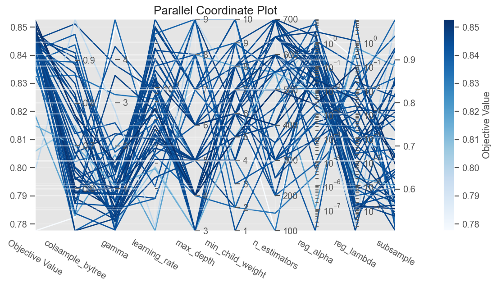
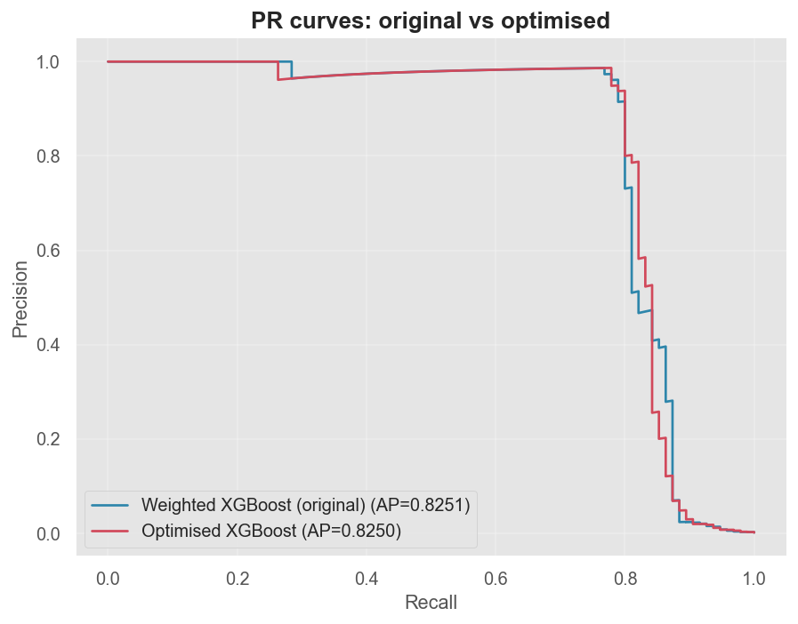
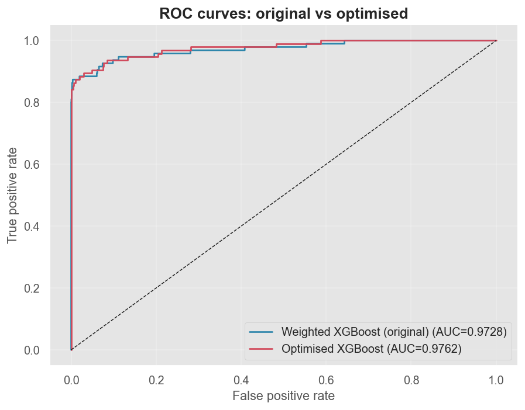
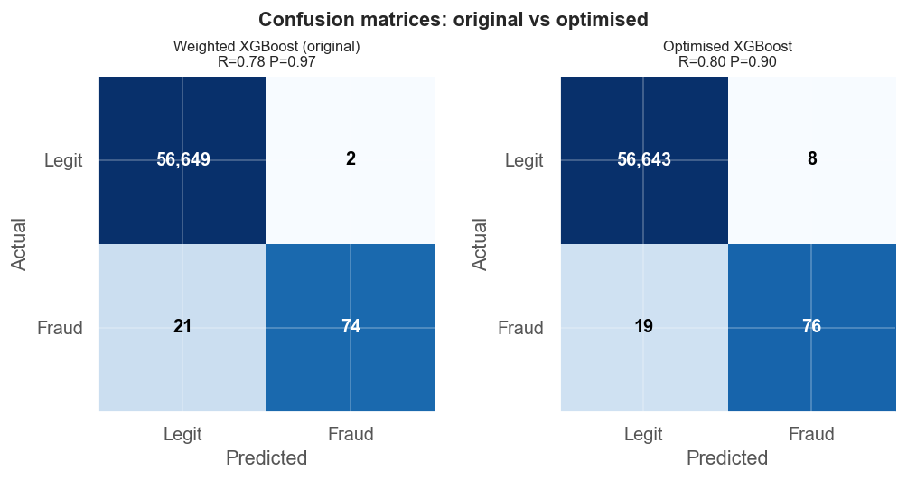

# Hyperparameter Optimisation — Weighted XGBoost (Milestone 7)

*Auto-generated by `fraud_detection.models.tuning`. Optimiser: Optuna (TPE),
50 trials, 3-fold stratified CV, target = **PR-AUC**.*

## Best trial

- **Trial #49** of 50
- **Cross-validated PR-AUC:** 0.8528

## Best parameters

| Parameter | Value |
|-----------|-------|
| `learning_rate` | 0.07103704793787298 |
| `max_depth` | 4 |
| `n_estimators` | 500 |
| `min_child_weight` | 5 |
| `subsample` | 0.6571956027677258 |
| `colsample_bytree` | 0.7709917278645344 |
| `gamma` | 1.6237760299213049 |
| `reg_alpha` | 0.0025479625424167035 |
| `reg_lambda` | 0.08806606108738492 |

(Fixed, not searched: `scale_pos_weight` = n_neg/n_pos, `tree_method="hist"`,
`eval_metric="logloss"`.)

## Performance: original vs optimised (test set)

| Metric | Original | Optimised | Δ |
|--------|---------:|----------:|---:|
| PR-AUC | 0.8251 | 0.8250 | -0.0002 |
| ROC-AUC | 0.9728 | 0.9762 | +0.0034 |
| Precision | 0.9737 | 0.9048 | -0.0689 |
| Recall | 0.7789 | 0.8000 | +0.0211 |
| F1 | 0.8655 | 0.8492 | -0.0163 |
| Accuracy | 0.9996 | 0.9995 | -0.0001 |
| Training time (s) | 6.355 | 25.096 | +18.742 |
| Prediction time (s) | 0.161 | 0.427 | +0.267 |

- Original confusion: TP=74, FP=2, FN=21, TN=56649
- Optimised confusion: TP=76, FP=8, FN=19, TN=56643

**PR-AUC change: -0.0002** (no improvement).

## Figures

### Optuna optimisation history

### Hyperparameter importance

### Parallel coordinate

### PR / ROC / confusion (original vs optimised)

## Final production recommendation

**Weighted XGBoost (original)** (PR-AUC **0.8251**, recall
0.779, precision 0.974) is the
recommended model. Tuning did not beat the strong default; keep the original weighted XGBoost. Optuna confirms the defaults are already near-optimal for PR-AUC on this data. The operating
**threshold** (recall vs false-alarm cost) is chosen in Milestone 8.

Artifacts: `models/tuned_xgboost.joblib`, `models/optuna_study_xgboost.pkl`,
`reports/07_tuning_results.csv`.
