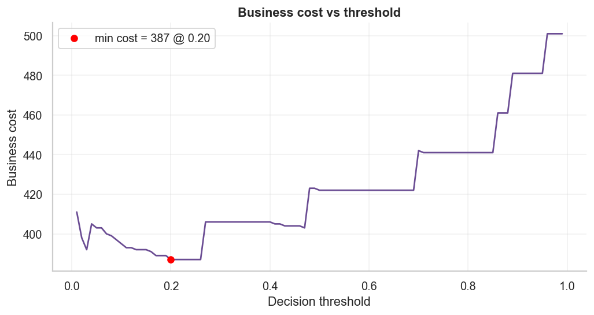
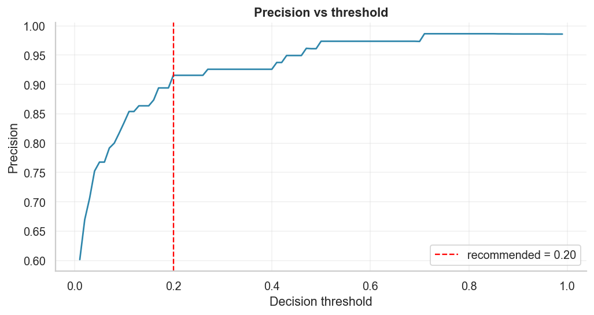
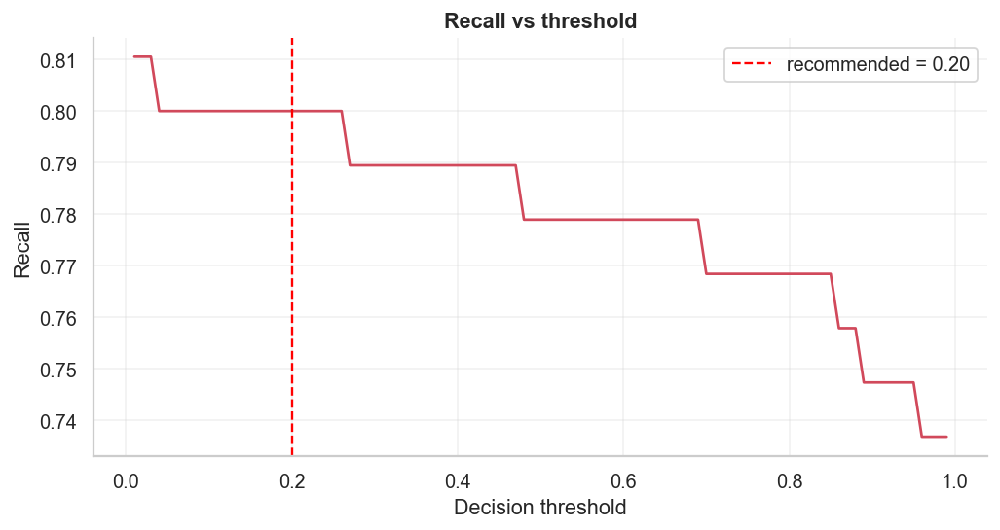
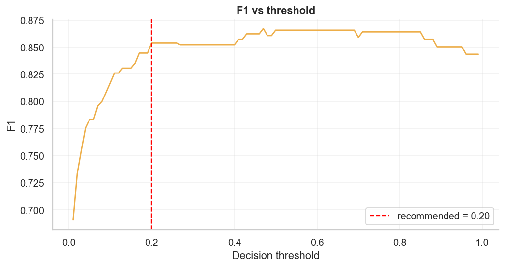
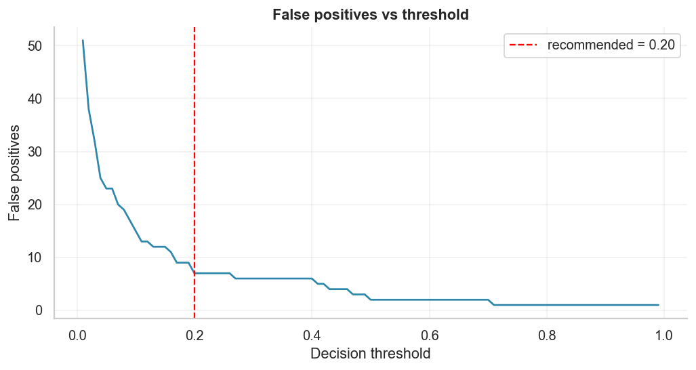
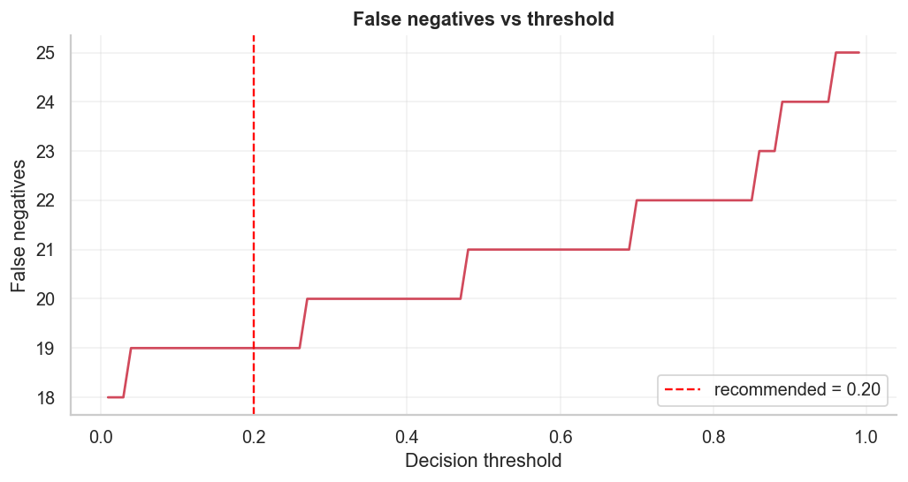
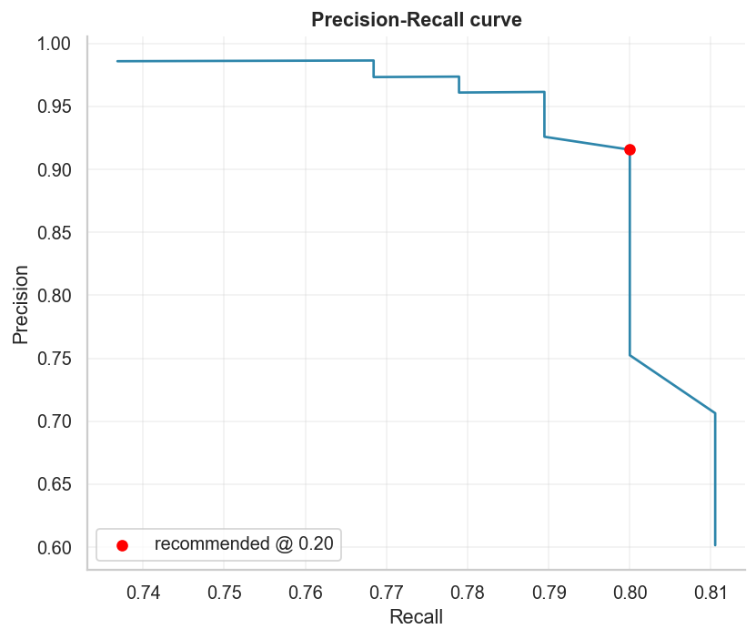
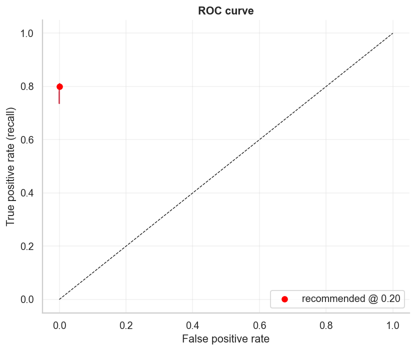

# Threshold Optimisation & Business Decision Analysis (Milestone 8)

*Auto-generated by `fraud_detection.evaluation.threshold`. Model: saved weighted
XGBoost (inference only, not retrained). Test set: 56,746 rows, 95
frauds. Cost model: FP=1, FN=20.*

## Recommended production threshold

**0.20** — minimises total business cost at **387**
(vs 422 at the default 0.50 → **35 saved**).
At this cut-off: recall **0.800** (76/95 frauds
caught), precision **0.916**, 7 false positives,
19 missed frauds.

## Operating points

| Operating point | Thr | Precision | Recall | F1 | FP | FN | Cost |
|---|---|---|---|---|---|---|---|
| Best precision | 0.71 | 0.986 | 0.768 | 0.864 | 1 | 22 | 441 |
| Best recall | 0.03 | 0.706 | 0.811 | 0.755 | 32 | 18 | 392 |
| Best F1 | 0.47 | 0.962 | 0.789 | 0.867 | 3 | 20 | 403 |
| **Min cost (recommended)** | 0.20 | 0.916 | 0.800 | 0.854 | 7 | 19 | 387 |
| Default (0.50) | 0.50 | 0.974 | 0.779 | 0.865 | 2 | 21 | 422 |

## Business cost analysis

With **FN 20x more costly than FP**, the optimiser lowers the threshold
below 0.50 to catch more fraud: each extra fraud caught (−20 cost) is
worth accepting up to 20 additional false positives (+1
each). The minimum-cost point sits where that trade-off balances.

## Trade-offs

- **Lower threshold →** higher recall, more false positives (customer friction),
  lower precision.
- **Higher threshold →** higher precision, fewer false alarms, but more missed
  fraud (expensive under this cost model).
- The default 0.50 is precision-oriented; the business-optimal point here is
  **0.20**, trading some precision for materially lower cost.

## Final production recommendation

Deploy the weighted XGBoost at a **decision threshold of 0.20**
(not 0.50) under the FP=1/FN=20 cost model, catching
80% of fraud at 92% precision.
Re-run `fraud-detect optimise-threshold --fp-cost <a> --fn-cost <b>` whenever the
business cost ratio changes. Full per-threshold metrics:
`reports/08_threshold_metrics.csv`.
