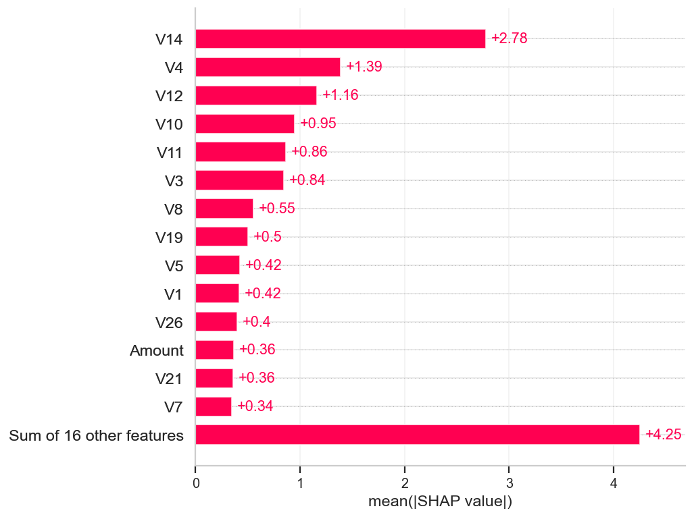
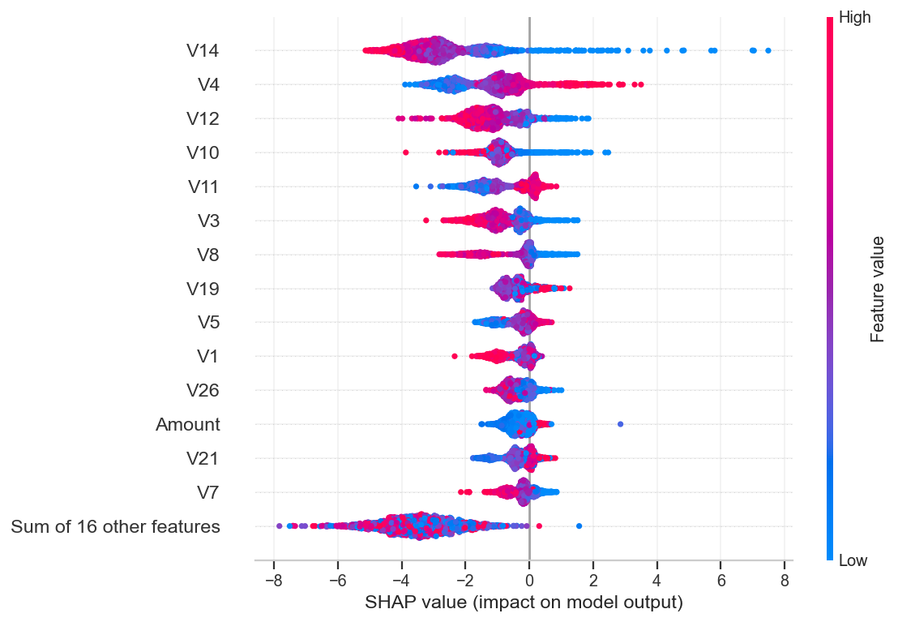
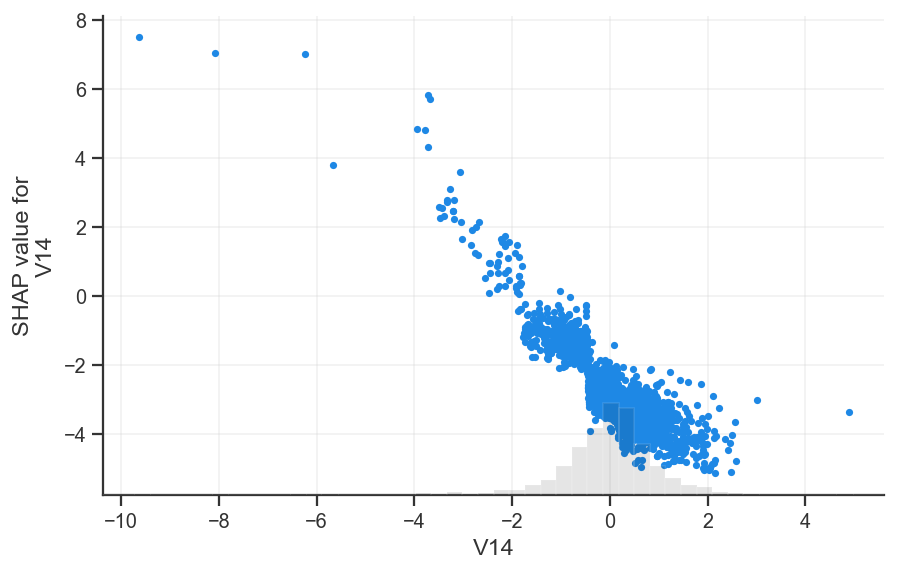
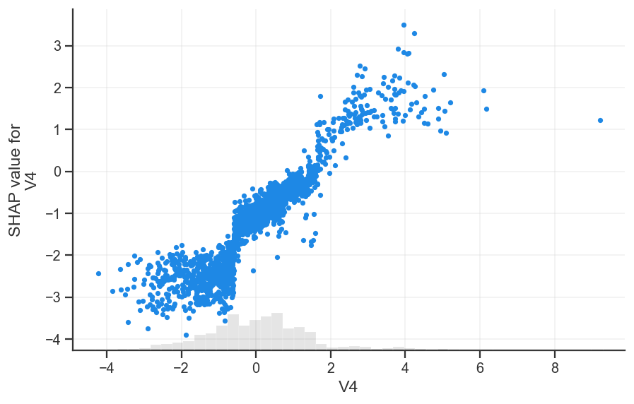
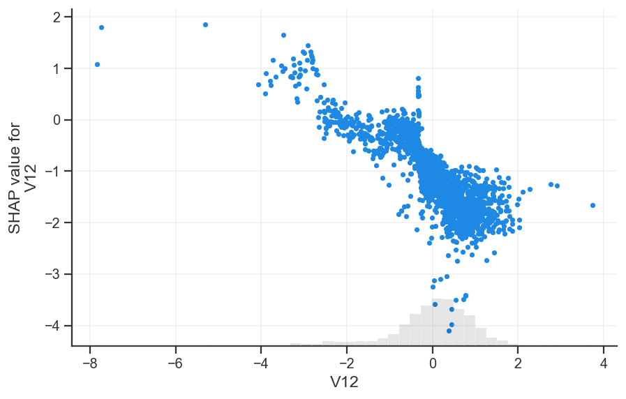
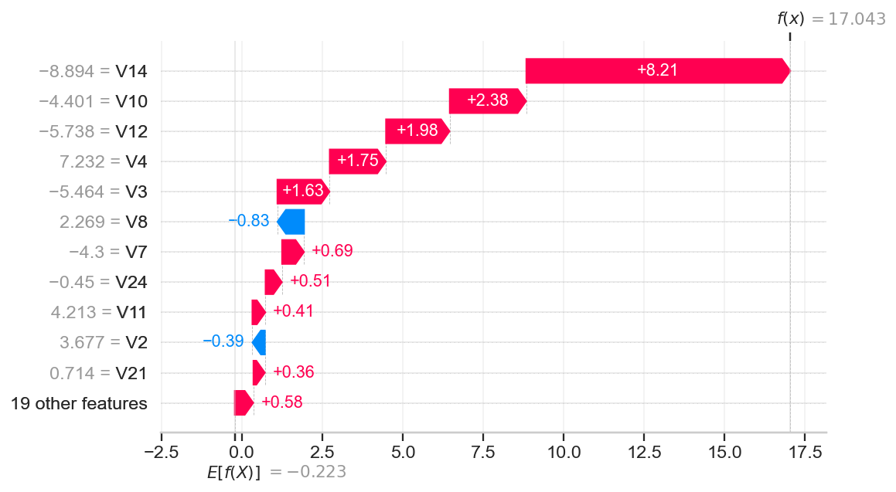
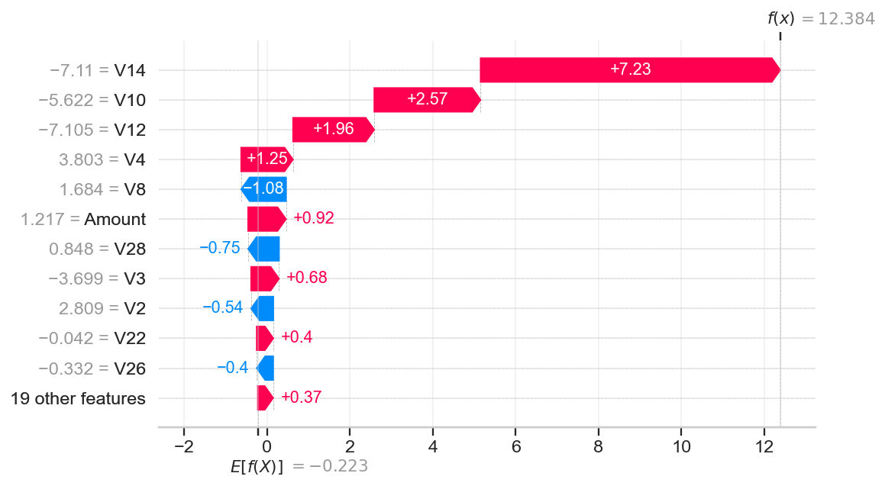
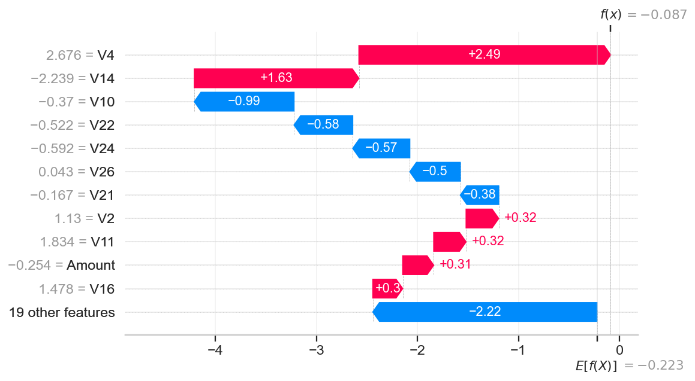
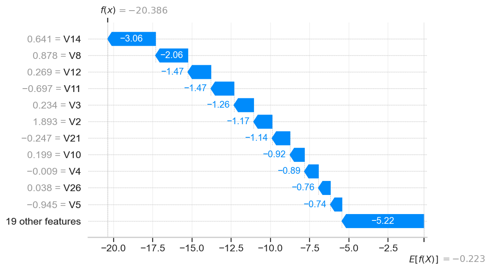

# SHAP Explainability — Production Fraud Model (Milestone 9)

*Auto-generated by `fraud_detection.evaluation.explainability`. Model: saved
weighted XGBoost (inference only). Explainer: SHAP TreeExplainer (exact).
SHAP values are in log-odds; the model's base (expected) value is
**-0.223**. Global plots use a random sample of 2,000 test
rows; categories are taken at threshold 0.50.*

## Global feature importance

Features ranked by mean absolute SHAP value (impact on the fraud score):

| Rank | Feature | Mean \|SHAP\| | Direction |
|---|---|---|---|
| 1 | `V14` | 2.7803 | lower -> more fraud |
| 2 | `V4` | 1.3889 | higher -> more fraud |
| 3 | `V12` | 1.1639 | lower -> more fraud |
| 4 | `V10` | 0.9471 | lower -> more fraud |
| 5 | `V11` | 0.8637 | higher -> more fraud |
| 6 | `V3` | 0.8436 | lower -> more fraud |
| 7 | `V8` | 0.5543 | lower -> more fraud |
| 8 | `V19` | 0.5004 | higher -> more fraud |
| 9 | `V5` | 0.4248 | higher -> more fraud |
| 10 | `V1` | 0.4211 | lower -> more fraud |

**Why the model predicts fraud.** The score is dominated by a small set of PCA
components — **`V14`, `V4`, `V12`** lead. The beeswarm shows the
direction: for the strongest drivers, *low* values push a transaction toward
fraud (red on the left), consistent with the EDA finding that fraud sits in the
negative tail of `V14`, `V12`, `V10`, `V17`. `Amount` and `Time` contribute
comparatively little.

## Dependence — how the top features drive the score

## Local explanations by prediction type

Representative predictions for each confusion-matrix category, with the features
that most moved each decision (waterfall = base value → final log-odds):

### True Positive (fraud caught)

Row 50775 — predicted fraud probability **1.000** (threshold 0.50). Top drivers:

| Feature | Value | SHAP contribution |
|---|---|---|
| `V14` | -8.894 | +8.208 |
| `V10` | -4.401 | +2.379 |
| `V12` | -5.738 | +1.980 |
| `V4` | +7.232 | +1.749 |
| `V3` | -5.464 | +1.626 |
| `V8` | +2.269 | -0.833 |
| `V7` | -4.300 | +0.689 |
| `V24` | -0.450 | +0.513 |

### False Positive (false alarm)

Row 33810 — predicted fraud probability **1.000** (threshold 0.50). Top drivers:

| Feature | Value | SHAP contribution |
|---|---|---|
| `V14` | -7.110 | +7.232 |
| `V10` | -5.622 | +2.565 |
| `V12` | -7.105 | +1.960 |
| `V4` | +3.803 | +1.251 |
| `V8` | +1.684 | -1.083 |
| `Amount` | +1.217 | +0.915 |
| `V28` | +0.848 | -0.747 |
| `V3` | -3.699 | +0.675 |

### False Negative (missed fraud)

Row 32879 — predicted fraud probability **0.478** (threshold 0.50). Top drivers:

| Feature | Value | SHAP contribution |
|---|---|---|
| `V4` | +2.676 | +2.493 |
| `V14` | -2.239 | +1.630 |
| `V10` | -0.370 | -0.987 |
| `V22` | -0.522 | -0.581 |
| `V24` | -0.592 | -0.565 |
| `V26` | +0.043 | -0.500 |
| `V21` | -0.167 | -0.380 |
| `V2` | +1.130 | +0.323 |

### True Negative (correct legit)

Row 2051 — predicted fraud probability **0.000** (threshold 0.50). Top drivers:

| Feature | Value | SHAP contribution |
|---|---|---|
| `V14` | +0.641 | -3.056 |
| `V8` | +0.878 | -2.060 |
| `V12` | +0.269 | -1.470 |
| `V11` | -0.697 | -1.468 |
| `V3` | +0.234 | -1.256 |
| `V2` | +1.893 | -1.173 |
| `V21` | -0.247 | -1.142 |
| `V10` | +0.199 | -0.920 |

## Key observations

1. Fraud decisions are **driven by a handful of PCA components** (`V14`, `V4`, `V12`),
   not by `Amount` or `Time`.
2. The **direction is consistent** with the EDA: extreme (mostly negative) values
   of the top `V` features push toward fraud.
3. **False positives** typically arise when a legitimate transaction happens to
   share those extreme feature values; **false negatives** are frauds whose top
   features look close to normal — visible in their waterfalls.
4. SHAP gives per-transaction, auditable reasons for each alert — essential for a
   fraud system that must justify blocking a customer's card.

Artifacts: `reports/09_shap_feature_importance.csv`, figures under `figures/`.
